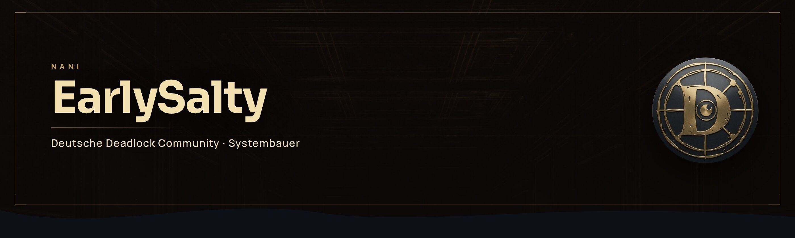
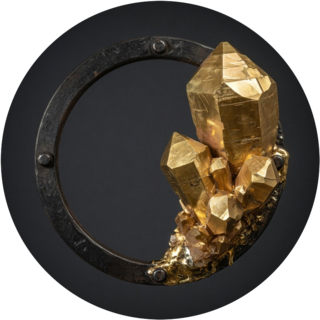

 

---

## Über mich

Hey, ich bin **Nani**, auf GitHub **EarlySalty**. Ich habe die [**Deutsche Deadlock Community**](https://deutsche-deadlock-community.de) gebaut und betreibe sie: Discord, Twitch, Steam, Website und Turniere. Rund **2.500 Mitglieder**, deutschsprachig, von Spielern für Spieler.

Die Website ist [deutsche-deadlock-community.de](https://deutsche-deadlock-community.de). Für Creator zählt vor allem die [Streamer-Seite](https://deutsche-deadlock-community.de/streamer/). Mail: [mail@earlysalty.com](mailto:mail@earlysalty.com).

Ich stream selbst auf [Twitch](https://www.twitch.tv/earlysalty) und baue die Werkzeuge, mit denen andere Creator und Spieler auf dem Server zurechtkommen. Wenn nachts etwas ausfällt, gehe ich selbst ran.

Seit August 2025 läuft das auf einem eigenen Root-Server. Rust in Produktion, PostgreSQL als Speicher, KI-Agenten für den Betrieb.

---

## Discord

Der Server ist das Zuhause der Community: Mitspieler, Coaching, Builds, Patchnotes, Voice.

- **[Mitspieler finden (LFG)](https://deutsche-deadlock-community.de/mitspieler/):** Modus, Rang, freie Plätze. Der Bot schiebt dich in die passende Lane. Doku: [LFG](https://deutsche-deadlock-community.de/docs/discord-server/module/mitspielersuche-lfg.html), [Ablauf](https://deutsche-deadlock-community.de/docs/discord-server/workflows/mitspieler-finden.html).
- **[Voice-Router](https://deutsche-deadlock-community.de/docs/discord-server/voice-features.html):** Sprachkanäle für Ranked, Casual, Custom. [Lane anlegen](https://deutsche-deadlock-community.de/docs/discord-server/workflows/voice-lane-erstellen-verwalten.html), Leute reinholen. [TempVoice](https://deutsche-deadlock-community.de/docs/discord-server/tempvoice-guide.html).
- **[Steam-Verifikation und Rang](https://deutsche-deadlock-community.de/docs/discord-server/steam-integration.html):** Steam-Konto verknüpfen, [Rang sichtbar machen](https://deutsche-deadlock-community.de/docs/discord-server/workflows/steam-verknuepfen-rang.html).
- **[Onboarding](https://deutsche-deadlock-community.de/docs/discord-server/onboarding-und-invites.html):** Rollen und Einstieg laufen automatisch. [Beitreten](https://deutsche-deadlock-community.de/beitreten/).
- **[Coaching](https://deutsche-deadlock-community.de/coaching/):** kostenlose Replay-Analyse und Lane-Grundlagen. [Anfragen](https://deutsche-deadlock-community.de/docs/discord-server/workflows/coaching-anfragen.html).
- **[!brain](https://deutsche-deadlock-community.de/docs/discord-server/module/brain.html):** Fragen zu Helden, Items, Builds und Mechaniken im Kanal.
- **[Scrims](https://deutsche-deadlock-community.de/docs/discord-server/scrims.html), [Custom Games](https://deutsche-deadlock-community.de/docs/discord-server/custom-games.html), [Turniere](https://deutsche-deadlock-community.de/turnier/):** organisierte Runden, nicht nur Solo-Queue.
- **[Patchnotes](https://deutsche-deadlock-community.de/patch/):** neue Deadlock-Patches auf dem Server, ohne Copy-Paste.

🔗 [Discord beitreten](https://discord.gg/PhkP3WgY7w) · [Server-Doku](https://deutsche-deadlock-community.de/docs/discord-server/ueber-bot-und-server.html) · [Regeln](https://deutsche-deadlock-community.de/docs/discord-server/regeln.html) · [FAQ](https://deutsche-deadlock-community.de/faq/)

---

## Streams

Ich spiele Deadlock live und baue den Twitch-Bot, den Community-Streamer selbst einrichten.

Mein Kanal: [twitch.tv/earlysalty](https://www.twitch.tv/earlysalty)

Was der Bot für Creator auf dem Server macht:

- **Selfservice:** Streamer verbinden den Kanal per Twitch-OAuth. Einstieg: [Streamer-Seite](https://deutsche-deadlock-community.de/streamer/), [Onboarding](https://deutsche-deadlock-community.de/streamer/onboarding/), [Einrichtung](https://deutsche-deadlock-community.de/docs/twitch-bot/einrichtung.html).
- **Go-Live auf Discord:** sobald der Stream startet, landet die Ankündigung auf dem Server. [Doku](https://deutsche-deadlock-community.de/docs/twitch-bot/discord-golive.html).
- **Auto-Raids:** am Streamende geht der Raid zu einem anderen Community-Kanal, der gerade live ist. [Doku](https://deutsche-deadlock-community.de/docs/twitch-bot/auto-raid.html).
- **Chat:** Bot im Chat als `deutschedeadlockcommunity`. [Befehle](https://deutsche-deadlock-community.de/docs/twitch-bot/chat-befehle.html), [Moderation](https://deutsche-deadlock-community.de/docs/twitch-bot/chat-moderation.html).
- **Dashboard:** Viewer, Chat, Titel, Tags, Raid-Wirkung. [Öffentliche Demo](https://deutsche-deadlock-community.de/twitch/demo) · [Analytics-Doku](https://deutsche-deadlock-community.de/docs/twitch-bot/analytics-dashboard.html) · [Streamer-FAQ](https://deutsche-deadlock-community.de/streamer/faq/).

Partner werden: [Streamer-Partner](https://deutsche-deadlock-community.de/docs/discord-server/workflows/streamer-partner-werden.html) · [Twitch-Bot Überblick](https://deutsche-deadlock-community.de/docs/twitch-bot/twitchbot-ueberblick.html)

---

## Bots

Alles eigene Dienste, keine zusammengekauften Fertig-Bots.

| Dienst | Was er tut | Seite |
|---|---|---|
| Discord-Bot | Onboarding, LFG, Voice-Router, Ränge, Coaching, Moderation, Brain | [Bots und Dienste](https://deutsche-deadlock-community.de/docs/discord-server/bots-und-dienste.html) |
| Twitch-Bot | Chat, Go-Live, Auto-Raid, Analytics, Streamer-Dashboard | [Twitch-Bot](https://deutsche-deadlock-community.de/docs/twitch-bot/twitchbot-ueberblick.html) |
| Steam-Bot | Profil- und Match-Abgleich, Rang aus den Spieldaten | [Steam-Bot](https://deutsche-deadlock-community.de/docs/steam-bot/steam-bot.html) |
| Patchnotes-Bot | Deadlock-Patches auf den Server bringen | [Patchnotes-Bot](https://deutsche-deadlock-community.de/docs/patchnotes-bot/patchnotes-bot.html) |
| Turniere | Brackets und Betrieb für Community-Turniere | [Turnierplattform](https://deutsche-deadlock-community.de/turnier/) · [Doku](https://deutsche-deadlock-community.de/docs/turniere/turniere.html) |
| Spam-Erkennung | Vorprüfung durch ein Sprachmodell, Entscheidungen stehen im Log | [Blog: Spam-Bots](https://deutsche-deadlock-community.de/blog/spam-bots-2026/) |

KI-Aufrufe laufen über eine eigene Schnittstelle. Das Modell dahinter ist austauschbar.

---

## Coding

Ich baue Systeme, die im Alltag der Community laufen, nicht Demos.

- **Rust** in Produktion (Serenity, Axum, sqlx). Python ist der Altbestand, vor allem noch im Twitch-Bot.
- **TypeScript und React** für Streamer-Dashboard und Website.
- **PostgreSQL** als zentrale Datenbank, TimescaleDB für Zeitreihen. Kein SQLite mehr im Live-Betrieb.
- **Caddy** als Proxy, **Docker** wo es passt, **systemd** für die eigenen Units.
- Ein Root-Server: Discord, Twitch, Steam, Website und Docs auf einer Maschine.
- APIs: Discord Gateway und Slash-Commands, Twitch EventSub und OAuth, Steam Web-API.

Öffentlicher Code liegt unter [github.com/EarlySalty](https://github.com/EarlySalty). Ein Teil der Bots ist privat, weil Tokens, Moderationslogik und Betriebsdaten nicht auf die Straße gehören.

---

## Eigene Seiten

Alles unter [deutsche-deadlock-community.de](https://deutsche-deadlock-community.de), live geprüft.

### Streamer

- [Streamer](https://deutsche-deadlock-community.de/streamer/)
- [Onboarding](https://deutsche-deadlock-community.de/streamer/onboarding/)
- [Streamer-FAQ](https://deutsche-deadlock-community.de/streamer/faq/)
- [Dashboard-Demo](https://deutsche-deadlock-community.de/twitch/demo)
- [Twitch-Bot Überblick](https://deutsche-deadlock-community.de/docs/twitch-bot/twitchbot-ueberblick.html)
- [Analytics](https://deutsche-deadlock-community.de/docs/twitch-bot/analytics-dashboard.html)
- [Auto-Raid](https://deutsche-deadlock-community.de/docs/twitch-bot/auto-raid.html)
- [Go-Live auf Discord](https://deutsche-deadlock-community.de/docs/twitch-bot/discord-golive.html)
- [Chat-Befehle](https://deutsche-deadlock-community.de/docs/twitch-bot/chat-befehle.html)

### Community

- [Start](https://deutsche-deadlock-community.de/)
- [Mitspieler](https://deutsche-deadlock-community.de/mitspieler/)
- [Coaching](https://deutsche-deadlock-community.de/coaching/)
- [Aktivität und Ränge](https://deutsche-deadlock-community.de/aktivitaet/)
- [Patchnotes](https://deutsche-deadlock-community.de/patch/)
- [Tierlist und Builds](https://deutsche-deadlock-community.de/builds/)
- [Helden](https://deutsche-deadlock-community.de/helden/)
- [Einsteiger-Guide](https://deutsche-deadlock-community.de/guides/anfaenger/)
- [Beitreten](https://deutsche-deadlock-community.de/beitreten/)
- [FAQ](https://deutsche-deadlock-community.de/faq/)
- [Wohin das hier soll](https://deutsche-deadlock-community.de/wohin/)
- [Transparenz](https://deutsche-deadlock-community.de/transparenz/)
- [Turnierplattform](https://deutsche-deadlock-community.de/turnier/)

### Docs

- [Docs-Index](https://deutsche-deadlock-community.de/docs/)
- [Discord-Server](https://deutsche-deadlock-community.de/docs/discord-server/ueber-bot-und-server.html)
- [Voice](https://deutsche-deadlock-community.de/docs/discord-server/voice-features.html)
- [Steam](https://deutsche-deadlock-community.de/docs/steam-bot/steam-bot.html)
- [Patchnotes-Bot](https://deutsche-deadlock-community.de/docs/patchnotes-bot/patchnotes-bot.html)
- [Turniere](https://deutsche-deadlock-community.de/docs/turniere/turniere.html)
- [Website-Portale](https://deutsche-deadlock-community.de/docs/website/website-portale.html)

### Blog

- [Blog](https://deutsche-deadlock-community.de/blog/)
- [Spirit Slop: Wann Deadlocks Gun-Meta wirklich kippte](https://deutsche-deadlock-community.de/blog/deadlock-spirit-slop-2026/)
- [Ist Deadlock tot? Was unsere Zahlen sagen](https://deutsche-deadlock-community.de/blog/deadlock-stimmung-2026/)
- [Spam- und Scam-Bots im deutschen Deadlock-Chat](https://deutsche-deadlock-community.de/blog/spam-bots-2026/)
- [Zehn Monate deutsche Deadlock-Streamer auf Twitch](https://deutsche-deadlock-community.de/blog/twitch-szene-2026/)

---

## Woran ich arbeite

  
  
  
  
  
  

---

## Tech Stack

### Sprachen

  

### Systeme und Tools

  

---

## Projekte

### Deutsche Deadlock Community

Website, Discord und die Dienste, die den Server tragen. Rund 2.500 Mitglieder, Mitspieler, Coaching, Voice, Streamer.

🔗 [deutsche-deadlock-community.de](https://deutsche-deadlock-community.de) · [Streamer](https://deutsche-deadlock-community.de/streamer/) · [Discord](https://discord.gg/PhkP3WgY7w)

### Twitch-Bot und Streamer-Dashboard

Selfservice für Community-Streamer: OAuth, Go-Live, Auto-Raid, Analytics. Demo ist öffentlich.

🔗 [EarlySalty/Deadlock-Twitch-Bot](https://github.com/EarlySalty/Deadlock-Twitch-Bot) · [Demo](https://deutsche-deadlock-community.de/twitch/demo) · [Streamer](https://deutsche-deadlock-community.de/streamer/)

### Turniere

Turnierbetrieb für die Community, Rust und Axum.

🔗 [Turnierplattform](https://deutsche-deadlock-community.de/turnier/) · [EarlySalty/Deadlock-Turniere](https://github.com/EarlySalty/Deadlock-Turniere)

### Docs

Öffentliche Seiten für Spieler: Discord-Server, Twitch-Bot, Steam, Helden, Patchnotes.

🔗 [deutsche-deadlock-community.de/docs](https://deutsche-deadlock-community.de/docs/) · [EarlySalty/Deadlock-Docs](https://github.com/EarlySalty/Deadlock-Docs)

---

## GitHub

---

### Systeme bauen, die die Community tragen.

[deutsche-deadlock-community.de](https://deutsche-deadlock-community.de) · [Streamer](https://deutsche-deadlock-community.de/streamer/) · [mail@earlysalty.com](mailto:mail@earlysalty.com)

